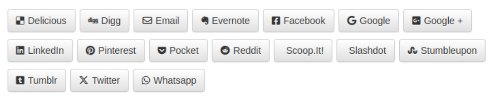

# Social links




## Usage

Install *SocialLinks* using *Composer*

```bash
composer require rezozero/social-links
```

Configure your `SocialLinks` instance with your data source and some
output settings.

```php
// Construct a new SocialLinks
$share = new \RZ\SocialLinks\SocialLinks(array(
    'url' => 'http://www.rezo-zero.com',
    'title' => 'REZO ZERO website homepage',
    // Optional image source url for pinterest
    'imageUrl' => 'http://www.rezo-zero.com/templates/rezo-zero/img/apple-icon.png',
    // Optional status for overriding title for twitter, whatsapp and emails body
    'status' => 'Hey! Look at this awesome website.'
));

// Set link class prefix
$share->setClassPrefix('social-link');

// Set social icons class prefix
// Use fa for Font Awesome or an
// other for a custom icon set.
$share->setIconPrefix('fa');

// Optional:
// Set link additional classes, for example
// to add "btn" bootstrap classes.
$share->setLinkClasses('btn btn-default');
```

### Single Url

```php
echo $share->getUrl('twitter');

// https://twitter.com/intent/tweet?text=Hey%21%20Look%20at%20this%20awesome%20website.%20%E2%80%94%20http%3A%2F%2Fwww.rezo-zero.com
```

### Single Link with icon

```php
$share->setClassPrefix('social-link');
$share->setIconPrefix('fa');
echo $share->getLink('facebook', $share->getIcon('facebook'));

// <a class="social-link social-link-facebook" target="_blank" rel="nofollow" href="https://www.facebook.com/sharer/sharer.php?u=http%3A%2F%2Fwww.rezo-zero.com"><i class="social-link-icon fa fa-facebook"></i><span class="social-link-name">Facebook</span></a>
```

### Single Link with SVG <use> tag

```php
$share->setClassPrefix('social-link');
$share->setIconPrefix('fa');
echo $share->getLink('facebook', $share->getUseSVG('facebook'));

// <a class="social-link social-link-facebook" target="_blank" rel="nofollow" href="https://www.facebook.com/sharer/sharer.php?u=http%3A%2F%2Fwww.rezo-zero.com"><svg class="social-link-icon fa fa-facebook"><use xlink:href="#fa-facebook"></use></svg><span class="social-link-name">Facebook</span></a>
```

### A bunch of links with their icons

Without icons:

```php
echo $share->getLinks(array('facebook', 'twitter', 'linked-in'));
```

With `<i>` icons:

```php
echo $share->getLinksWithIcon(array('facebook', 'twitter', 'linked-in'));
```

With `<svg>` icons:

```php
echo $share->getLinksWithSVG(array('facebook', 'twitter', 'linked-in'));
```

You also can choose a not empty separator, i.e. a dash:

```php
echo $share->getLinksWithIcon(array('facebook', 'twitter', 'linked-in'), ' - ');
```

## Available networks

* delicious
* digg
* email
* evernote
* facebook (*sharer* by default, or */dialog/feed* if you provide a `facebookAppId`)
* friendfeed
* google
* google-plus
* linked-in
* newsvine
* pinterest
* pocket
* reddit
* scoop-it
* slashdot
* stumbleupon
* tumblr
* twitter
* whatsapp

## Twig extension

```php
$twig->addExtension(new \RZ\SocialLinks\Twig\SocialLinksExtension());
```

`SocialLinksExtension` *Twig* extension introduces 3 new filters to be able 
to generate your social links without any PHP code.

* `social_links`
* `icon_social_links`
* `svg_social_links`

First you’ll need to gather your social data in an associative array or 
simply `set` a string variable (it will be used as the URL).

```twig

{# or #}

```

Then, you can use one of the 3 *SocialLinks* filters with or without optional
arguments. Selected networks can be set using an array or a simple string.

```twig
<nav class="social-links">
    {{ social_data|social_links(['facebook', 'twitter']) }}
</nav>

<nav class="social-links">
    {{ social_data|social_links('twitter') }}
</nav>

<nav class="social-links">
    {{ social_data|icon_social_links(['facebook', 'twitter'], 'icon-prefix', 'class-prefix', 'link-classes') }}
</nav>
```
